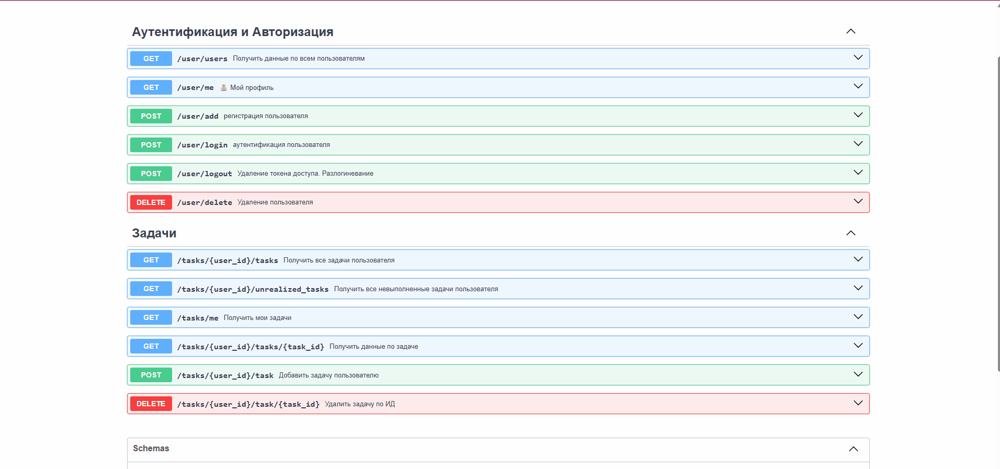

# Это проект для отработки межсервисного взаимодействия через retry, jitter, circuit_breaker
Есть два сервиса:
- retry_project_1 - это базовый сервис в нем реализована аутентификация пользователя и создание аутентифицированному пользователю
задач
- retry_project_2 - это второй сервис, который обращается к первому, берет все невыполненные задачи, анализирует их на просроченность
и добавляет в свою базу данных просроченных задач по пользователю. Если задача просрочена, но она уже есть в базе второго сервиса,
то дублирование не происходит

##  Пример работы сервисов через свагер документацию:

## Основная логика ретраев
1. В папке `Retry_project_2/src/api/routers/over_task_routers.py` находится эндпойнты, отвечающие за работу сервиса
2. При вызове `@router.get("/{user_id}/new_over_task"` происходит инициализация базы данных сервиса, создается сессия для работы с репозиторием
и происходит создание сессии связи с первым сервисом за счет создание http_client `Retry_project_2/src/services/http_client.py`
3. Эндпойнт передает вызов на соответствующий сервисный слой
4. в BaseService, от которого наследуются другие классы `Retry_project_2/src/services/base_service.py`, происходит инициализация 
паттерна `circuit_breaker`
5. в TaskService(BaseService) происходит инициализация паттерна `retry` в функции `get_unrealized_tasks_from_external_with_retry`
 Порядок вызова:
        1. Circuit Breaker проверяет состояние
        2. Если CLOSED/HALF_OPEN → выполняет запрос с retry
        3. При успехе → сбрасывает счётчик ошибок
        4. При ошибке → увеличивает счётчик, может открыть цепь
6. Логика `retry` и `jitter` описана в `Retry_project_2/src/retry_logic/retry_client.py`
7. Логика `circuit_breaker` описана в `Retry_project_2/src/retry_logic/circuit_breaker.py`

## Установка
1. Скачать проект с гитхаба
~~~pycon
/opt/getcourse# git clone https://github.com/MaksAnikeev/it_bot.git .
~~~
2. Создать файл `.env` в корне проекта и прописать туда переменные окружения

данные пустой БД в постгри, она создастся автоматически по указанным вами данным
DB_HOST=
DB_PORT=
DB_NAME=
DB_USER=
DB_PASS=

флаг для переключения вида разработки
MODE=LOCAL

токены авторизации для создания ключей авторизации
JWT_SECRET_KEY=
JWT_ALGORITHM=
JWT_ACCESS_TOKEN_EXPIRE_MINUTES=

TASK_SERVICE_URL="http://localhost:8000"

Пример
~~~pycon
MODE=LOCAL

DB_HOST=localhost
DB_PORT=5436
DB_NAME=tasks
DB_USER=postgres
DB_PASS=123456

JWT_SECRET_KEY=09d25e094faa6ca2556c818166b7a9563b93f7099f6f0f4caa6cf6
JWT_ALGORITHM=HS256
JWT_ACCESS_TOKEN_EXPIRE_MINUTES=30

TASK_SERVICE_URL="http://localhost:8000"
~~~

3. Установить зависимости/библиотеки
~~~pycon
pip install poetry
poetry init

# указываем чтобы поетри работало с виртуалкорй, чтобы не писать каждый раз `poetry run`
poetry config --local virtualenvs.in-project true

poetry install
~~~

4. Активировать окружение
.\.venv\Scripts\activate

5. Обновить все пакеты
poetry update

6. Развернуть базу данных в докер контейнере
~~~pycon
docker compose up -d
~~~

7. Установить миграции
~~~pycon
alembic upgrade head  
~~~

8. Запустить проект
~~~pycon
python -m src.main  
~~~